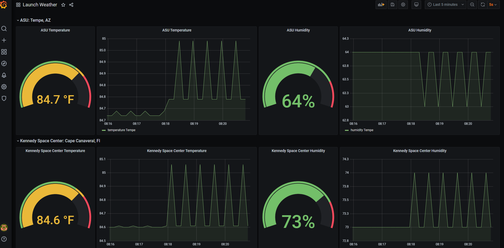

# terraform-docker weather dashboard

Was able to deploy nodered, infludb, and grafana. Loaded a flow into node and passed in credentials for influxdb. API used was from https://openweathermap.org/ to get weather information from cape canaveral and tempe.

# DEMO

First I accessed my influxdb and nodered container by using {public-ip}:{external-port} and created a user. Then I obtaind my token to use for nodered. 

Next I created a dashboard in grafana to more easily present my information. To do this, go to configuration and load your data sources and chooose influxdb.

